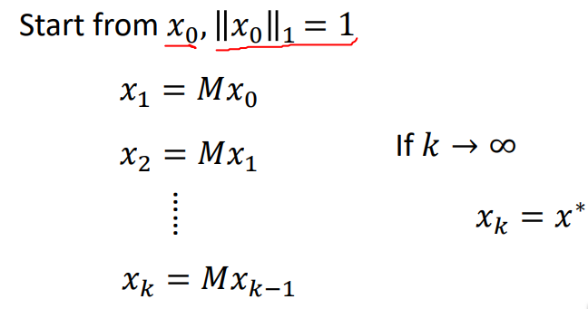

# Homework 4: Page Rank

## Purpose:

本次作業主要是練習 page rank 的實作。

## Summary

Page rank 其實就是要解  這個問題，其中 x 為 page 的分數，A 描述 page 之間的關聯，稱為 transition matrix，且每行總合為 1。每一個元素代表著 page 之間的關係。其實也就是解一個擁有 eigenvalue 為 1 的矩陣。

另外為了讓 page rank 是唯一的，必須將式子修改成，這式子代表的意思是，一部分按照網頁 (矩陣 A) 本身的關係，另一部份 (矩陣 S) 為 page 之間關連的隨機項，每一行的和一樣為 1 (像是有買廣告的可能別的 page 跳到該 page 機率就會比較大)。

**另外一個矩陣每行的和為 1 必會有 1 這個 eigen value**。實際在解這個 eigen value 為 1 的 eigen vector，不會用列運算，因為這個矩陣通常很大，所以會利用 Power method 這個方法來解，另外這方法收斂數度也很快。

Power method 其實就是要找到一個  使得  其中 。透過跌代的方式找出解，作法如下圖

而 Power method 這個方法的期始值並不影響最後的結果，證明如下:其中  為上述的 S，R 為上述的 x

## Reference

- [原始課程作業說明](https://docs.google.com/presentation/d/1-UnqnfrfYWClPqBrck5KRTQrNGamwbkKBL3asb9j9bk/edit?fbclid=IwAR1uyZM3M3NTdkeuuzHHGQuiqYzvWfTcUhK18q7xBbx3cOTg_JWp5NTt0bs)

- [Power 迭代法](https://ccjou.wordpress.com/2010/11/02/power-%E9%81%9E%E8%BF%B4%E6%B3%95/)